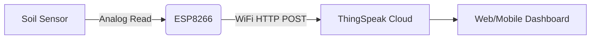

```markdown
# 🌱 IoT Soil Moisture Monitoring System with ESP8266 & ThingSpeak  

**A robust, real-time soil moisture detection system for smart agriculture, built on IoT principles.**  
*By [Your Name] | Est. 2024 | [](https://opensource.org/licenses/MIT)*  

---

## 📌 Overview  
This project leverages an **ESP8266 microcontroller** and a **soil moisture sensor** to monitor soil hydration levels in real-time. Data is transmitted to **ThingSpeak IoT Cloud** for visualization and analysis, enabling precision agriculture and automated irrigation systems.  

🔹 **Key Features:**  
- Real-time analog soil moisture sensing  
- WiFi connectivity (ESP8266)  
- Seamless ThingSpeak cloud integration  
- Scalable for multi-field deployments  

---

## 🛠 Hardware Components  
| Component          | Specification               |  
|--------------------|-----------------------------|  
| Microcontroller    | ESP8266 (NodeMCU/Wemos D1)  |  
| Soil Moisture Sensor | Capacitive/Analog (A0)      |  
| Power Supply       | 5V USB / 3.3V Battery       |  

---

## 📡 Software Setup  

### 🔧 Dependencies  
- **ESP8266WiFi.h** (Built-in Arduino Core for ESP8266)  
- Arduino IDE (v2.0+) / PlatformIO  

### ⚙️ Configuration  
1. **WiFi Credentials**  
   ```cpp
   const char* ssid = "YOUR_SSID";  
   const char* password = "YOUR_PASSWORD";  
   ```
2. **ThingSpeak API**  
   ```cpp
   const char* thingspeak_api_key = "YOUR_API_KEY";  
   const char* thingspeak_channel_id = "YOUR_CHANNEL_ID";  
   ```

---

## 🚀 Deployment Steps  

1. **Hardware Assembly**  
   - Connect the soil sensor to `A0` pin.  
   - Power the ESP8266 via USB or 3.3V source.  

2. **Upload Code**  
   - Compile & flash `soil_moisture_iot.ino` using Arduino IDE.  

3. **ThingSpeak Dashboard**  
   - Create a channel with `Field1` for moisture data.  
   - Visualize trends using built-in MATLAB widgets.  

---

## 📊 Data Flow Architecture  


---

## 🎛️ Code Highlights  

### 🌐 WiFi Initialization  
```cpp
WiFi.begin(ssid, password);  
while (WiFi.status() != WL_CONNECTED) {  
    delay(1000);  
    Serial.println("Connecting to WiFi...");  
}  
```

### 📤 ThingSpeak POST Request  
```cpp
String post_data = "field1=" + String(soil_moisture_value);  
client.print("POST /update HTTP/1.1\n");  
client.print("Host: api.thingspeak.com\n");  
...  
```

---

## 📈 Sample Output  
```plaintext
Soil Moisture: 642  
Uploading to ThingSpeak...  
HTTP Response: 200 OK  
```

---

## 🌟 Advanced Modifications  
- **Multi-Sensor Support**: Add `field2` for temperature (DHT11).  
- **Low-Power Mode**: Deep sleep ESP8266 between readings.  
- **Alert System**: Trigger IFTTT/SMS on dry soil.  

---

## 📜 License  
MIT © [Your Name] - *"Because soil deserves a voice."*  

[](https://buymeacoffee.com/yourprofile)  
```

### 🎨 Pro Tips for GitHub Aesthetics:  
1. Use **emoji headers** (like 📌, 🛠) for visual hierarchy.  
2. Add a **mermaid diagram** (GitHub supports it natively!).  
3. Keep tables and code blocks syntax-highlighted.  
4. Badges (shields.io) make it look "pro".  

Simply copy-paste this into your `README.md`! 🚀
